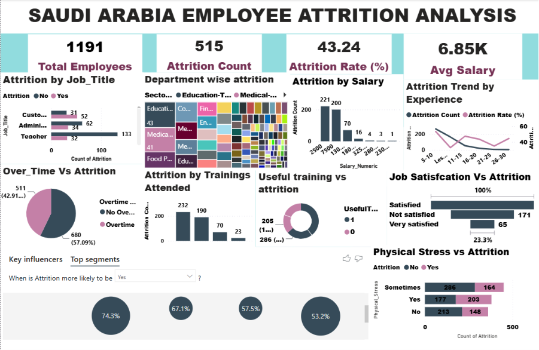

# 📊 Employee Attrition Analysis Dashboard using Power BI

## 📌 Project Overview

Employee attrition is a major challenge for organizations as it impacts productivity, employee morale, and business performance. This project analyzes employee attrition using Microsoft Power BI by examining employee demographics, job and compensation details, training records, and workplace satisfaction factors.

The dashboard provides interactive insights to help HR professionals identify the key factors influencing employee turnover and support data-driven employee retention strategies.

---

## 🖼️ Dashboard Preview

> **Note:** Replace `dashboard.png` with your actual image filename if it is different.

---

## 🎯 Project Objectives

- Analyze the overall employee attrition status.
- Identify departments and job roles with the highest attrition.
- Evaluate the impact of salary, work experience, and overtime on employee attrition.
- Analyze the effectiveness of employee training programs.
- Assess employee satisfaction and workplace well-being.
- Identify the key organizational factors influencing employee attrition.
- Enable interactive employee attrition analysis using dashboard slicers.

---

## 📂 Dataset Information

The cleaned HR dataset was organized into four logical tables:

- 👥 Employee Demographics
- 💼 Job & Compensation
- 🎓 Training Details
- 😊 Satisfaction & Attrition

The tables are connected using the **Employee_ID** field through **One-to-One (1:1)** relationships in Power BI.

---

## 🧹 Data Preparation

The following preprocessing steps were completed before visualization:

- Removed duplicate records
- Standardized categorical values
- Cleaned missing and inconsistent data
- Renamed columns
- Converted data types
- Created analytical columns using Excel formulas
- Split the cleaned dataset into four logical tables

---

## 📈 Dashboard Features

- KPI Cards
- Clustered Bar Charts
- Clustered Column Charts
- Treemap
- Donut Charts
- Line Chart
- Stacked Bar Chart
- Stacked Column Chart
- Key Influencers Visual
- Interactive Slicers

---

## 🔑 Key Insights

- Employee attrition is influenced by rewards and wages satisfaction, job engagement, promotions, training effectiveness, and workplace stress.
- Departments and job roles with higher attrition can be easily identified.
- Salary, work experience, and overtime provide valuable insights into employee retention.
- Employee training and workplace satisfaction play an important role in reducing attrition.
- Interactive filters enable dynamic analysis across different employee groups.

---

## 🛠️ Tools & Technologies

- Microsoft Power BI
- Microsoft Excel
- Power Query
- DAX (Measures)
- Data Modeling

---

## 📊 Power BI Concepts Used

- Data Cleaning
- Data Modeling
- One-to-One Relationships
- KPI Cards
- Interactive Dashboard Design
- Slicers
- Key Influencers Visual
- Drill-through & Cross-filtering

---

## 📌 Business Value

This dashboard helps HR professionals:

- Monitor employee attrition trends
- Identify high-risk employee groups
- Understand the key drivers of attrition
- Support employee retention strategies
- Make informed, data-driven HR decisions

---

## 🚀 Future Enhancements

- Employee Attrition Prediction using Machine Learning
- Real-time HR Database Integration
- Automated Dashboard Refresh
- Attrition Forecasting
- AI-based Retention Recommendations

---

## 👩‍💻 Author

**Janani Tamilselvan**

Data Analytics | Power BI | Excel

